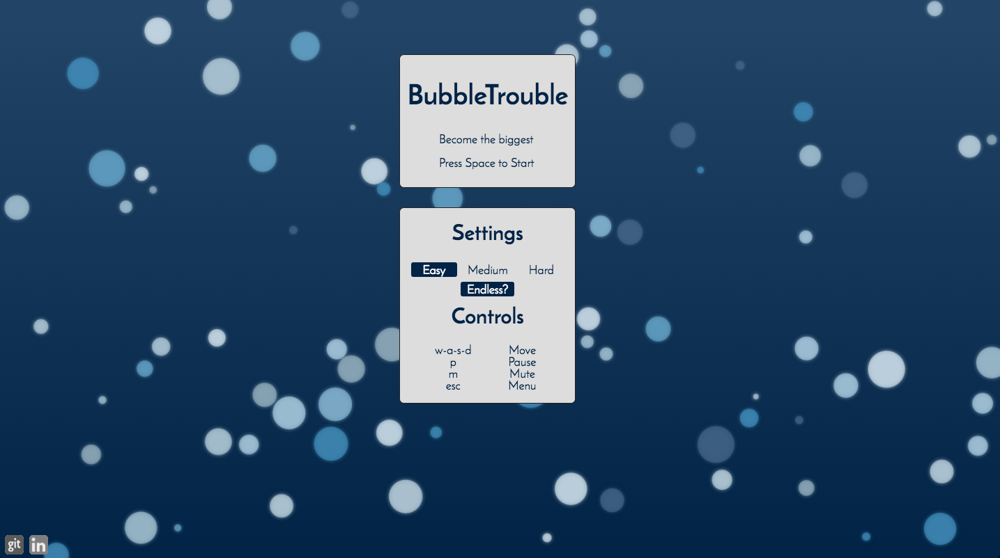
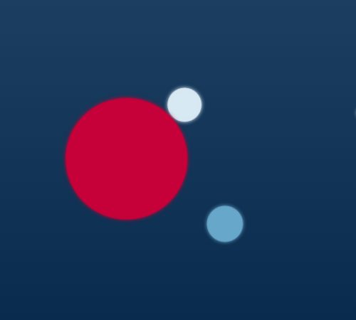

# BubbleTrouble

[BubbleTrouble live](http://adoundakov.github.io/bubbleTrouble)

## Background

BubbleTrouble is a reimagining of the popular eat-or-be-eaten game [agario](www.agar.io), with players roaming around a game board in pursuit of food. A player can absorb food or another player if that bubble is smaller in size. Alternatively, the player can be eaten by bubbles that are bigger in size.

There are many variations of Agario out there, with different twists. This simulation eschews the multiplayer aspect of the game in favor of a more robust  single player experience (like [Osmos](http://www.osmos-game.com/)).

## Functionality and MVP

In BubbleTrouble, players will be able to:

- [x] Start and pause/play a randomly generated game board.
- [x] Choose from 3 preset difficulties (easy, medium, hard)
- [x] Play any of the 3 presets in 'endless mode'  
- [x] Learn about the implementation of the game through Production ReadMe

## Graphics

BubbleTrouble is a single page app, without any database. The single screen contains the game viewport, difficulty controls, and nav links to relevant pages (GitHub, my LinkedIn).

The difficulty controls consist of 4 buttons: easy, medium, hard, and an additional toggle for endless mode.

In endless mode, once the player eats all the bubbles on the screen they are returned to the center and new bubbles are spawned.

## Implementation

BubbleTrouble is written in basic JavaScript, with the graphical manipulation done through an HTML5 Canvas element. Webpack is used to bundle up and serve various scripts needed by the project.

#### Bubbles

Bubbles are created when the `game` is started. They are randomly distributed, with a 100 square pixel safety zone in the center, ensuring the player does not spawn into an enemy bubble.

A bubble is also initialized with a random blue color, radius, and velocity. The amount of starting bubbles is dependent on the difficulty selected in the main menu.

The bubble absorption logic is handled by the `collideWith(other)` method, which compares the two radii and absorbs the smaller into the larger.

#### Ship

The player ship has the same methods as a bubble, but also includes a `power()` method, that accelerates the ship while the user holds down a movement key. This is done to avoid the initial 500ms key-repeat delay on most keyboards (500ms for the first repeat, then 80ms per repeat additional keypresses).

## Bonus Features

There are a few bonus features that would add extra visual or gameplay elements, and are worth pursuing:

  - [ ] Different color schemes based on difficulty?
  - [ ] Gameplay overhaul to make it more like Osmos
      * To move you eject bubbles opposite of the direction you want to move, physics moves you around.
  - [ ] Add extra bubble Class (enemies) that have basic AI
      * Chase you if they are bigger, seek food if you are bigger.
  - [ ] Add special bubbles (attract / repulse)
