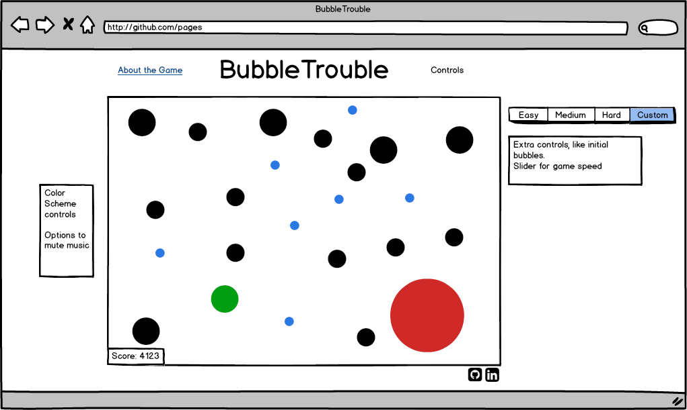

# Development README

## Background

BubbleTrouble is a reimagining of the popular eat-or-be-eaten game [agario](www.agar.io), with players roaming around a game board in pursuit of food. A player can absorb food or another player if that bubble is smaller in size. Alternatively, the player can be eaten by bubbles that are bigger in size.

There are many variations of Agario out there, with different twists. This simulation eschews the multiplayer aspect of the game in favor of a more robust  single player experience (like [Osmos](http://www.osmos-game.com/)).

## Functionality and MVP

In BubbleTrouble, players will be able to:

- [x] Start and pause/play a randomly generated game board.
- [x] Choose from 3 preset difficulties (easy, medium, hard)
- [x] Play any of the 3 presets in 'endless mode'  
- [x] Learn about the implementation of the game though:
  * A production README on the GitHub repo
  * An about section on the actual game page

## Wireframes

BubbleTrouble is designed to be a single page app, without any database. The single screen will have the game viewport, difficulty controls, nav links to relevant pages (GitHub, my LinkedIn), and an About modal.

The difficulty controls consist of 4 buttons: easy, medium, hard, and endless.

## Implementation

BubbleTrouble will be written in basic JavaScript, with the graphical manipulation done through an HTML5 Canvas element. Webpack will also be used to bundle up and serve various scripts needed by the project.

There will be a few helper scripts in this project:
  `board.js`: lightweight script that deals with redrawing board
  `util.js`: contains helper functions to assist in collision calculation etc.
  `ship.js`: handles player bubble movement and growth from absorbing other bubbles
  `bubble.js`: same as `ship.js` but without movement controls

## Development Timeline

**Day 1:** Basic project init, be able to render random array of bubbles to `Canvas` element. Write project skeleton.

**Day 2:** Build out bubble motion and collision detection. Write the `bubble.js` and `util.js` files. Goal by end of day is to have random motion of bubbles with working collisions.

**Day 3:** Add Player movement and begin visual styling of game, end game detection.

**Day 4:** Create visual sections of game. Build out styling and buttons, about page, and modal. Finish lingering ToDo items from Days 1-3. Begin bonus features if time.

## Class / File breakdown
- Util (lib/utils.js)
- Utility code, especially vector math stuff.
- MovingObject (lib/moving_object.js)
- Base class for anything that moves.
- Most important methods are MovingObject.prototype.move, MovingObject.prototype.draw(ctx), MovingObject.prototype.isCollidedWith(otherMovingObject).
- Bubble (lib/asteroid.js)
- Food for player. It inherits from MovingObject.
- Ship (lib/ship.js)
- This is you! Another MovingObject subclass.
- Game (lib/game.js)
- Holds collections of the food-bubbles and your ship.
- Game.prototype.step method calls Game.prototype.move on all the objects, and Game.prototype.checkCollisions checks for colliding objects.
- Game.prototype.draw(ctx) draws the game.
- Keeps track of dimensions of the space; wraps objects around when they drift off the screen.
- GameView (lib/game_view.js)
- Stores a Game instance.
- Stores a canvas context to draw the game into.
- Installs key listeners to move the ship and fire bullets.
- Installs a timer to call Game.prototype.step.

## Bonus Features

There are a few bonus features that would add extra visual or gameplay elements, and are worth pursuing:

  - [ ] Different color schemes based on difficulty?
  - [ ] Gameplay overhaul to make it more like Osmos
      * To move you eject bubbles opposite of the direction you want to move, physics moves you around.
  - [ ] Add extra bubble Class (enemies) that have basic AI
      * Chase you if they are bigger, seek food if you are bigger.
  - [ ] Add special bubbles (attract / repulse)
